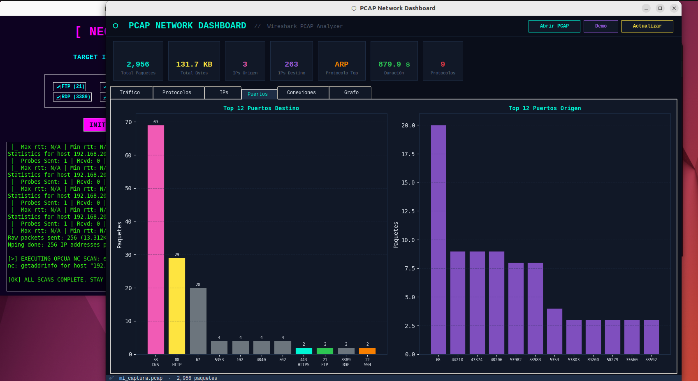

# ⬡ PCAP Network Dashboard


**PCAP Network Dashboard** es un conjunto de herramientas de visualización de tráfico de red desarrolladas en Python. Permite analizar archivos `.pcap` (Wireshark) y transformar datos de paquetes crudos en *dashboards* gráficos interactivos y estéticamente atractivos.

El proyecto incluye dos versiones independientes para adaptarse a tus necesidades:
1.  🖥️ **Desktop Edition (`pcap_dashboard_tk.py`):** Una aplicación nativa GUI construida con `Tkinter` y `Matplotlib`. Ideal para análisis local rápido sin levantar servidores.
2.  🌐 **Web Edition (`web_pcap_dashboard.py`):** Una aplicación web moderna e interactiva construida con `Dash` y `Plotly`. Perfecta para explorar los datos con zoom, hover y desplegar en red.

---

## 📸 Capturas de Pantalla

### 🖥️ Desktop Edition (Tkinter)
*Interfaz clásica, rápida y autocontenida.*


### 🌐 Web Edition (Dash)
*Interfaz moderna, interactiva y accesible desde el navegador.*


---

## ✨ Características Principales

Ambas versiones comparten un núcleo de análisis potente basado en **Scapy** y **Pandas**, ofreciendo las siguientes métricas:

* **📊 Análisis de Protocolos:** Distribución de protocolos (TCP, UDP, HTTP, DNS, etc.).
* **📈 Tráfico Temporal:** Visualización del volumen de datos (bytes/segundo) a lo largo del tiempo.
* **🌍 Top Talkers:** Identificación de las IPs de origen y destino más activas.
* **🔌 Puertos y Servicios:** Gráficos de los puertos más utilizados para identificar servicios.
* **🔥 Mapas de Calor:** Matriz de conexiones para ver quién habla con quién intensamente.
* **🕸️ Grafo de Red:** Visualización de nodos y aristas (IPs y conexiones) usando NetworkX.
* **🎲 Modo Demo:** Generación de tráfico sintético realista si no tienes un archivo `.pcap` a mano.

---

## 🛠️ Instalación

Clona el repositorio e instala las dependencias necesarias. Se recomienda usar un entorno virtual (`venv`).

```bash
git clone [https://github.com/robertotejado/pcap-dashboard.git](https://github.com/tu-usuario/pcap-dashboard.git)
cd pcap-dashboard

```

### Requisitos Generales

Ambas versiones requieren el motor de análisis y manipulación de datos:

```bash
pip install scapy pandas networkx

```

### Dependencias Específicas

| Versión | Librerías Necesarias | Comando de Instalación |
| --- | --- | --- |
| **Desktop** | `matplotlib`, `pillow` | `pip install matplotlib pillow` |
| **Web** | `dash`, `plotly`, `dash-bootstrap-components` | `pip install dash plotly dash-bootstrap-components` |

---

## 🚀 Uso

Puedes ejecutar cualquiera de los dos scripts directamente. Si no proporcionas un archivo `.pcap`, el script generará datos de **demostración** automáticamente.

### 1. Ejecutar Versión Desktop (Tkinter)

```bash
# Iniciar en Modo Demo
python3 pcap_dashboard_tk.py

# Analizar un archivo específico
python3 pcap_dashboard_tk.py mi_captura.pcap

```

*Se abrirá una ventana de tu sistema operativo con el dashboard. También puedes abrir la app sin argumentos y usar el botón "📂 Abrir PCAP" de la interfaz.*

### 2. Ejecutar Versión Web (Dash)

```bash
# Iniciar en Modo Demo
python3 web_pcap_dashboard.py

# Analizar un archivo específico
python3 web_pcap_dashboard.py mi_captura.pcap

```

*La aplicación iniciará un servidor local. Abre tu navegador y dirígete a:* `http://127.0.0.1:8050`

---

## 📂 Estructura del Proyecto

```text
📦 pcap-dashboard
 ┣ 📜 pcap_dashboard_tk.py    # Código fuente de la versión Desktop (Tkinter/Matplotlib)
 ┣ 📜 web_pcap_dashboard.py   # Código fuente de la versión Web (Dash/Plotly)
 ┣ 🖼️ PCAP-Dashboard-Desktop.png
 ┣ 🖼️ PCAP-Dashboard-Web.jpg
 ┗ 📜 README.md

```

## 🧠 Cómo Funciona

1. **Ingesta:** El script utiliza `rdpcap` de **Scapy** para leer el archivo paquete a paquete.
2. **Procesamiento:** Se extraen metadatos clave (IP origen/destino, puertos, protocolo, timestamp, tamaño) y se estructuran en un **DataFrame de Pandas** para facilitar el agrupamiento y filtrado.
3. **Visualización:**
* **Desktop:** Usa `FigureCanvasTkAgg` para incrustar gráficos estáticos de Matplotlib dentro de la ventana de Tkinter.
* **Web:** Utiliza componentes de Dash (`dcc.Graph`) para renderizar gráficos de Plotly que soportan interactividad nativa en el DOM.


## 🤝 Contribuciones

¡Las contribuciones son bienvenidas! Si tienes ideas para mejorar los gráficos, optimizar la lectura de archivos grandes (como leer en chunks) o añadir soporte para diseccionar más protocolos:

1. Haz un Fork del proyecto.
2. Crea una rama (`git checkout -b feature/NuevaGrafica`).
3. Haz Commit de tus cambios (`git commit -m 'Añade gráfico de latencia TCP'`).
4. Haz Push a la rama (`git push origin feature/NuevaGrafica`).
5. Abre un Pull Request.

---

*Desarrollado con ❤️, Python y mucho café.*
